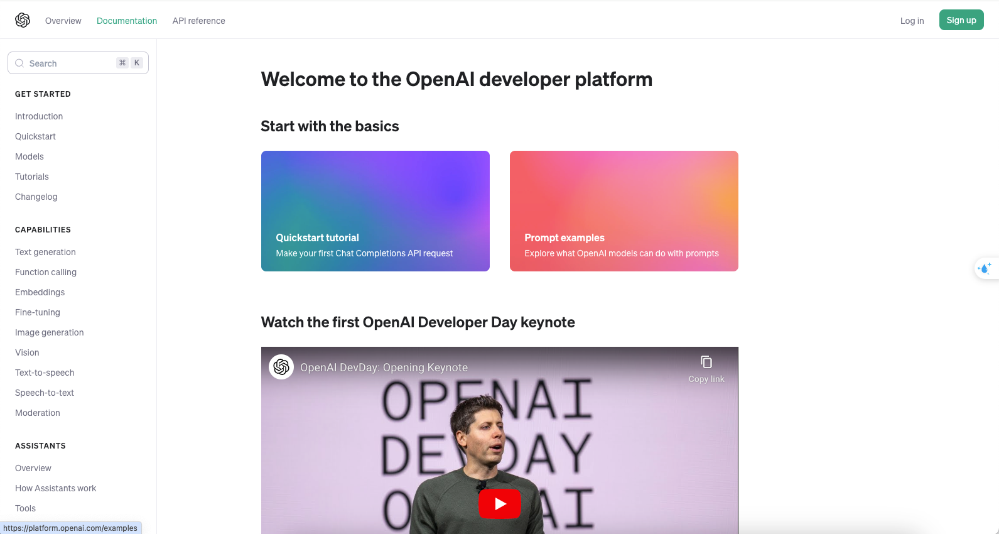
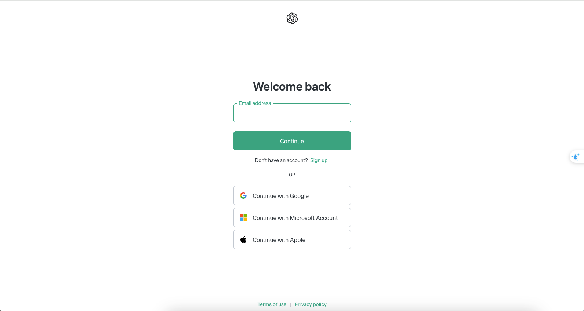
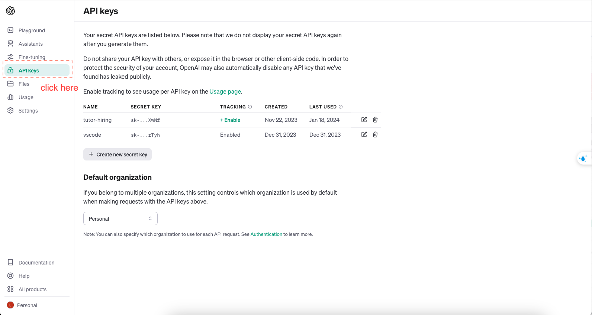
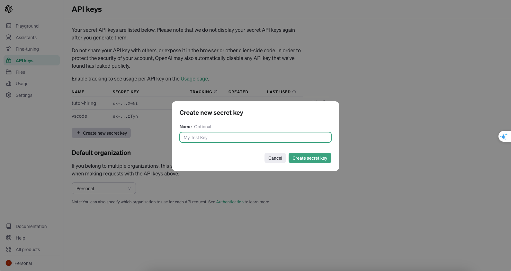
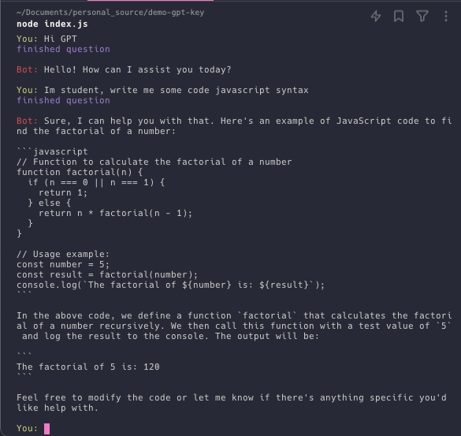

# Demo GPT key
## Get Api key
- Step 1 Access to link https://platform.openai.com/docs/overview

- Step 2: Login with existed account 

- Step 3: Navigate api key management

- Step 4: Create new key

## Implementation
Installation package [OpenAi](https://www.npmjs.com/package/openai?activeTab=readme) and flow documentation

```shell
npm install --save openai
# or
yarn add openai
```
### Usage
```javascript
import OpenAI from 'openai'; //es6 syntax
# or
const openai = require("openai"); 
```
### Code example
```javascript
const openai = require("openai");

const openAi = new openai({
    apiKey: process.env['OPENAI_API_KEY'], // patse the api here
});

const completionText = await openAi.chat.completions.create({
    model: "gpt-3.5-turbo",
    messages: [{ role: "user", content: "Hello GPT!" }],
    stream: true,
});

// stream response
for await (const chunk of completionText) {
    process.stdout.write(chunk.choices[0]?.delta?.content || "");
}
```

### Demo Result:



To perform the demo, please clone this repository and follow the instructions above
Quick start to the chat bot in demo:
```shell
yarn start
#or 
npm run start
```
 

